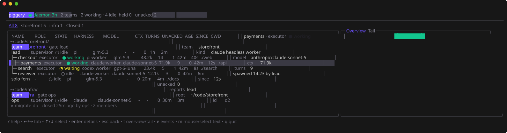
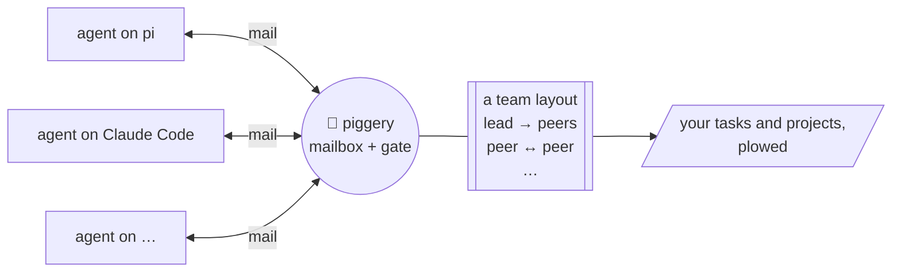

# Piggery 🐖 - Lợn cày tasks

Your coding agents are pigs. Piggery is the farm.

Work goes into a pig's trough and waits there until the pig is back. It only counts as eaten
when the job is actually done, not when the pig sniffed at it. Every pig also has a pen: its
role says who it may talk to and whether it may have piglets (workers). The farm checks the
fence itself, so no amount of sweet talk gets a pig through it.

pi, Claude Code, Codex, omp, dsh and opencode pigs all live on the same farm and talk to each other. The
farm is one Go binary and a SQLite file, and nothing runs in the cloud.



## How it works



- **One mailbox for every agent**, whatever its harness. A pi session can mail a Claude Code
  session, and a worker's answer wakes whoever is waiting for it.
- **A gate on every mail and every spawn.** It checks them against the team's layout, a small
  YAML file you pick or write.
- **Layouts are files.** Eight come built in (see [Farm layouts](#farm-layouts)); any other shape is
  one more file.

## Harnesses

| Harness | Your sessions | Workers piggery starts | Tested with | Add piggery |
|---|---|---|---|---|
| [pi](https://github.com/earendil-works/pi) | yes (extension) | yes (`pi --mode rpc`) | 0.87.1 | `piggery setup pi` |
| [Claude Code](https://claude.com/product/claude-code) | yes (plugin + MCP) | yes (`claude -p`) | 2.1.283 | `piggery setup claude` |
| [Codex](https://github.com/openai/codex) | yes (hooks + MCP) | yes (`codex app-server`) | 0.157.1 | `piggery setup codex` |
| [omp](https://github.com/can1357/oh-my-pi) | yes (extension) | yes (`omp --mode rpc`) | 18.4.2 | `piggery setup omp` |
| [dsh](https://github.com/deepseek-ai/deepseek-harness) | yes (`dsh web`, plugin) | yes (`dsh --profile sdk`) | 0.2.0-rc.1 | `piggery setup dsh` |
| [opencode](https://opencode.ai) | yes (plugin) | yes (`opencode serve`) | 1.18.34 | `piggery setup opencode` |

- Workers run on the harness their role names (`spawn.harness`), else on the harness of the
  session that founded the team.
- `piggery setup` alone shows each harness's version and whether piggery is installed in it.

## Install

```sh
curl -fsSL https://raw.githubusercontent.com/sting8k/piggery/main/install.sh | sh
piggery setup pi       # and/or: claude, codex, omp, dsh, opencode
```

The script picks the build for your OS and CPU (Linux or macOS, amd64 or arm64), checks it
against the release's `checksums.txt`, and puts it in `~/.local/bin`.

- Another directory: `PIGGERY_INSTALL_DIR=...`. A given release: `PIGGERY_VERSION=v0.3.0`.
- By hand: download `piggery-<os>-<arch>` from the
  [latest release](https://github.com/sting8k/piggery/releases/latest), `chmod +x` it, put it on
  your PATH.
- With Go 1.26+: `go install github.com/sting8k/piggery/cmd/piggery@latest`.
- Later: `piggery update` installs a newer release. What changed is in [CHANGELOG.md](CHANGELOG.md).
- Using [Paseo](https://paseo.sh)? `piggery setup paseo` adds a Piggery view (the same as
  `piggery top`) to the app. Turn on plugins in Paseo's settings once.

## Quick start

1. Open pi, Claude Code, Codex, omp, `dsh web` or opencode in your project.
2. Ask it for a team: *"make a lead-peer team to fix the failing tests"*.
3. Watch the farm: `piggery top`.

More:

- [docs/guide.md](docs/guide.md): running teams, watching and stepping in, customizing `~/.piggery`.
- [docs/reference.md](docs/reference.md): every command, config key, profile key and manifest key.

## Farm layouts

| Template | Who does what |
| --- | --- |
| `p2p` | Peers that talk freely and spawn more peers. |
| `lead-peer` | A lead owns the plan and judges the results; peers own scopes and speak up with evidence. |
| `slp` | You steer a supervisor; each lane has a lead and peers, often in its own git worktree. |
| `council` | A chair asks members for independent views on one hard decision. |
| `amp-like` | A lead does the work; an oracle (hard reasoning) and a reviewer (diffs) each answer once. |
| `dual-lens` | A taskforce: a chair takes one hard question or review, asks two lenses on different models, then makes them answer each other's conflicts. |
| `advisor` | A taskforce of one: read-only advice on a hard decision or a stalled approach, with a check that would prove it wrong. |
| `gastown-like` | A mayor splits the work; polecats do each task on its own branch; a refinery merges them one at a time. |

Each one is drawn, with when to pick it, in [manifests/README.md](manifests/README.md).

Make your own: `piggery template new mine --from slp`, then edit
`~/.piggery/templates/mine/manifest.yaml` (see the [guide](docs/guide.md#customize-piggery-piggery)).

## Build from source

```sh
go build ./cmd/piggery
go test ./...
```

## License

MIT
