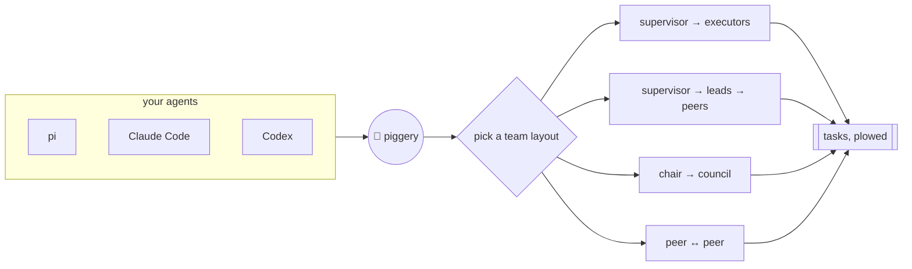

# Piggery 🐖 - Lợn cày tasks

Your coding agents are pigs. Piggery is the farm.

Work goes into a pig's trough and waits there until the pig is back. It only counts as eaten
when the job is actually done, not when the pig sniffed at it. Every pig also has a pen: its
role says who it may talk to and whether it may have piglets (workers). The farm checks the
fence itself, so no amount of sweet talk gets a pig through it.

pi, Claude Code and Codex pigs all live on the same farm. The farm is one Go binary and a
SQLite file, and nothing runs in the cloud.


## How it works



A layout is a small YAML file: the roles, who may talk to whom, and who may spawn whom.
Pick a built-in one or write your own; piggery enforces it on every send and spawn.

## Install

```sh
# macOS on Apple silicon. Other builds: darwin-amd64, linux-amd64, linux-arm64
curl -fsSLo piggery https://github.com/sting8k/piggery/releases/latest/download/piggery-darwin-arm64
chmod +x piggery && mv piggery ~/.local/bin/   # any directory on your PATH

piggery setup pi       # and/or: claude, codex
```

Using [Paseo](https://paseo.sh)? `piggery setup paseo` adds a Piggery view (the same as
`piggery top`) to the app. Turn on plugins in Paseo's settings once.

Or build it: `go install github.com/sting8k/piggery/cmd/piggery@latest` (Go 1.26+).
`piggery update` installs a newer release. Every release has a `checksums.txt`; what changed is in
[CHANGELOG.md](CHANGELOG.md).

## Quick start

1. Open pi, Claude Code or Codex in your project.
2. Ask it for a team: *"make a supervisor-executor team to fix the failing tests"*.
3. Watch the farm: `piggery top`.

## Farm layouts

| Template | Who does what |
| --- | --- |
| `supervisor-executor` | A supervisor splits the goal into checkable tasks; executors do them. |
| `slp` | You steer a supervisor; each lane has a lead and peers, often in its own git worktree. |
| `council` | A chair asks members for independent views on one hard decision. |
| `p2p` | Peers that talk freely and spawn more peers. |

Make your own: `piggery template new mine --from slp`, then edit
`~/.piggery/templates/mine/manifest.yaml`.

## Build from source

```sh
go build ./cmd/piggery
go test ./...
```

## License

MIT
