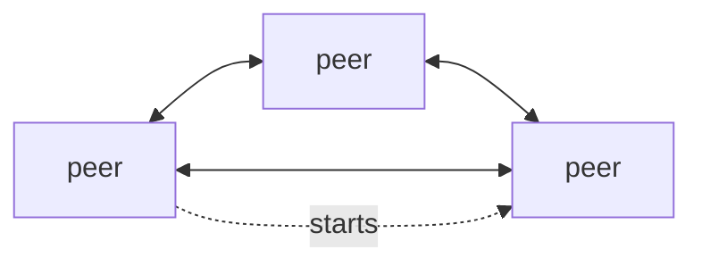
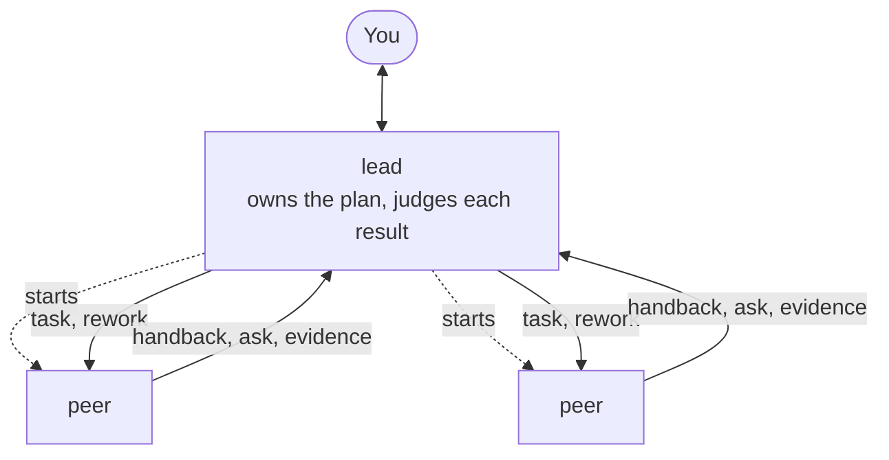
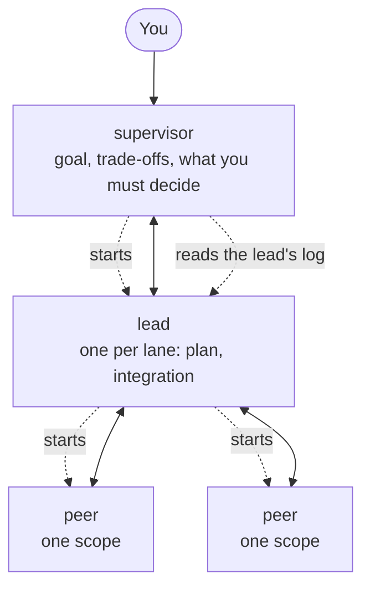
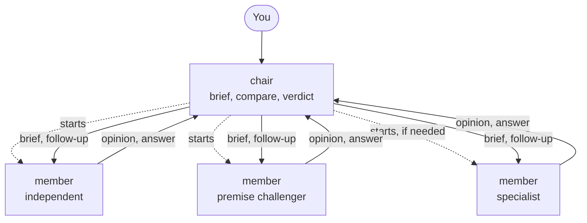
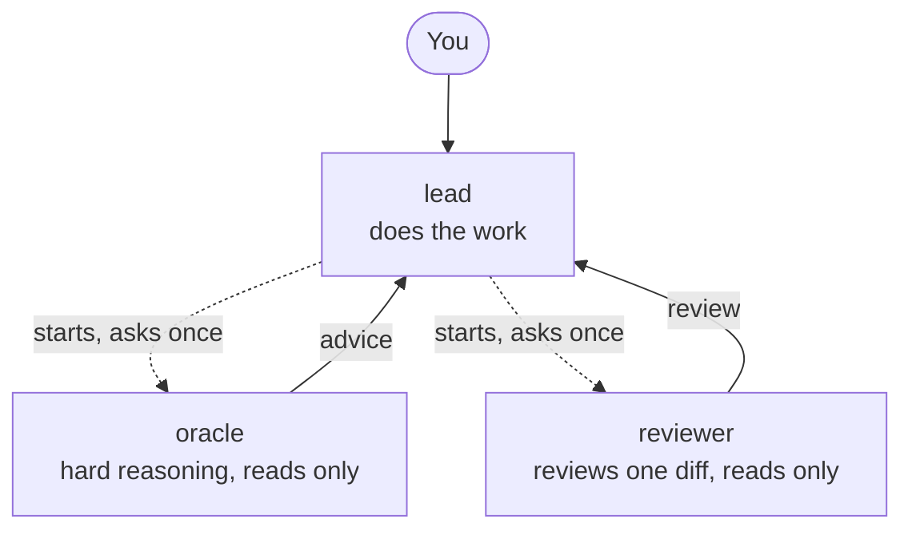
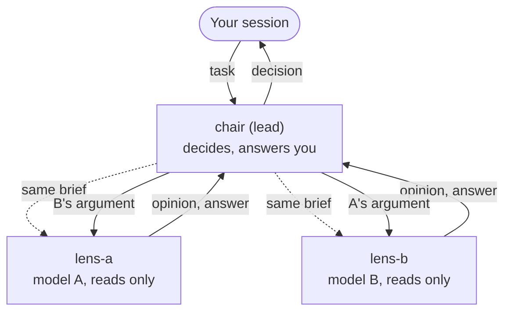
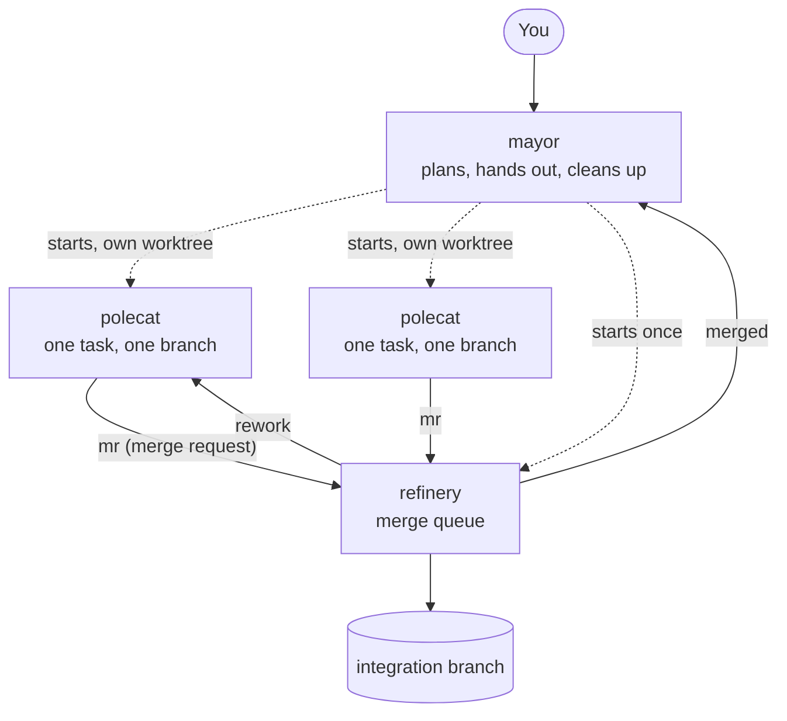

# The built-in team templates

A template is a small YAML file that says who is on a team, who may start whom, and who may write
to whom. piggery enforces the last two; the role prompts ask for the rest. This page shows each
built-in template as a picture, with when it fits.

How to read the diagrams: a box is a role. A solid arrow is "may send mail to". A dotted arrow is
"may start (spawn)". You talk to the role at the top, usually the session you opened yourself.
Anyone not connected by an arrow cannot reach the other, and that is on purpose.

| Template | Pick it when |
| --- | --- |
| [`p2p`](#p2p) | You want no structure at all, or a starting point for your own |
| [`lead-peer`](#lead-peer) | You have a goal that splits into checkable scopes, and you want one plan, a judge for each result, and workers that push back with evidence |
| [`slp`](#slp) | The work is big enough for lanes, each with its own plan, and you want to steer from above |
| [`council`](#council) (taskforce) | You face one hard decision and want independent, read-only opinions before choosing |
| [`amp-like`](#amp-like) | You want to do the work in one session and call a second brain now and then |
| [`dual-lens`](#dual-lens) (taskforce) | A hard technical question or an important review should get two independent answers on different models, settled by a read-only chair, while you stay in your session |
| [`advisor`](#advisor) (taskforce) | You are stuck on a decision or an approach and want one read-only second opinion, with a recommendation and a check that would prove it wrong |
| [`gastown-like`](#gastown-like) | Several coding tasks can run at once on separate branches and need merging |

Start one by asking your session to found it (`piggery template list` shows them). Copy one to
change it: `piggery template new mine --from <template>`.

A template marked (taskforce) has a `taskforce:` block: besides being founded as a long-lived team,
a solo session or a gate can call it up for one job (`spawn` with `template`); it works with
its own chair, reports to the caller, and is closed by the caller when the job is done.

## p2p

No roles, no rules beyond the limits. Every peer can talk to every peer and start more peers.
Good for trying piggery out, for a few equals working side by side, or as the plain base for a
template of your own.

## lead-peer

A lead and peers who may know as much as it does. The lead owns the plan: it cuts your goal into
scopes, briefs a peer for each with a check that proves it done, and judges every result; a
result that misses the check goes back with a note (`rework`). A peer follows the brief by
default and speaks up only with evidence that the plan is off (wrong premise, wrong focus, more
than the goal needs); the lead weighs that evidence, not who said it, and brings a disagreement it
cannot settle to you.

Peers cannot talk to each other. Anything they need from one another goes through the lead,
which keeps one view of the whole job. A second peer only starts when two scopes can really run
side by side; peers that would change the same files get their own branch and worktree.

## slp

Supervisor, Lead, Peer. Think of a project with lanes: one lane per part that can move and be
checked on its own (often one git worktree per lane). You settle the goal and the trade-offs with
the supervisor. Each lane gets a lead, who owns its plan and puts the pieces together. Peers each
own one scope inside the lane, and may push back on the plan with evidence.

The supervisor talks only to leads and watches a lane by reading its lead's log, so the lane's
plan stays in one place. A lead writes to its peers as a person would, so a peer sees only its work
and the one who gives it. One lane is the default; more lanes only when the parts really are
separate.

## council

A panel for one hard question. The chair writes a neutral brief and starts one member per angle
(by default: one who reasons from first principles, one who challenges the question itself, and a
domain specialist only when a domain's rules decide it). Members never see each other's answers.
The chair compares them, asks one follow-up where they really disagree, and gives you a verdict
with the dissent and what would reopen it.

The council ends at the verdict. If you then want it carried out, say so, or use another template
for the doing. Called up as a taskforce, the chair is a headless worker: it sends the verdict to the
session that called it, only reads, and the caller closes the taskforce.

## amp-like

After [Amp](https://ampcode.com)'s main agent with its oracle and code reviewer. You work with the
lead, which does the job itself. When it needs a harder think (a plan, a bug it is stuck on) it
starts an oracle; when a change deserves a second look it starts a reviewer. Each specialist
answers once and is stopped. The next question gets a fresh one, with a brief that carries what
was said before.

It pays off most when the specialists run a different model family from the lead, so they
actually think differently:

- the oracle: a strong reasoning model of another family (a `gpt-*` model when the lead runs
  `claude-*`, and the other way round), with a high thinking level;
- the reviewer: a third family if you have one (`gemini-*`).

Set them in `roles.oracle.spawn.model`, `roles.oracle.spawn.thinking` and
`roles.reviewer.spawn.model`, written the way that role's harness names models and levels.

## dual-lens

A taskforce for one hard technical question or one review. You (or your session, on its own
judgment) call it up with the task; its chair writes one neutral brief and gives it to two lenses
that run different models. Where both agree (or both reject) the chair takes it as settled. Where
they conflict, it hands each lens the other's argument to answer, then decides on the evidence and
sends you the decision, what both agreed on, each conflict and how it was settled, and what is
still open. The lenses never see each other, and nobody edits a file unless the task says so.

It pays off only when the two lenses run different model families: set
`roles.lens-a.spawn.model` and `roles.lens-b.spawn.model` (for example a `claude-*` and a `gpt-*`
model). Left at `inherit`, both run the same model. The chair is a headless worker; it stays for
follow-up questions. Your session closes the taskforce when it is done. You can also found
it as a long-lived team, with yourself as the one who asks.

## advisor

A taskforce of one, for a decision you are stuck on or an approach that is not working. The
advisor does not see your session: it works from your brief and the files it reads, and if
something missing would change its advice it asks you once by mail. It answers with a recommendation
and how confident it is, the evidence and assumptions, the credible alternatives and the strongest
downside, and the smallest check that could prove it wrong (marked as not run). It reads and
advises; it never edits, and you stay the one who decides. It is not for broad research, for
carrying out the change, or for a verdict that a change is ready.

Your session closes the taskforce when it is done. With
nobody else on the team there is no diagram: one worker, one asker.

## gastown-like

After [Gas Town](https://github.com/gastownhall/gastown)'s mayor, polecats and refinery. A small
coding factory: the mayor cuts your goal into tasks that touch different files, gives each its own
branch and worktree, and a polecat to do it. Finished branches queue up at the refinery, which
merges them one at a time into an integration branch and runs the tests after each. A branch that
conflicts or breaks the tests is undone and sent back to its polecat.

The mayor gets a copy of every merge request and every rework, so it always knows where each task
stands. Your own branch never moves by itself: when everything has landed on the integration
branch, the mayor tells you, and you decide. Gas Town's watchdog agents are left out; piggery
already tells the mayor when a member goes quiet.

## Limits every template has

Each template also sets a few guard rails: how deep a chain of starts may go (`depth`), how many
workers may run at once (`concurrency`), how much mail one member may send per minute, and timers
that tell a member's boss when it has been silent too long. Every key is in the
[reference](../docs/reference.md#manifest).
